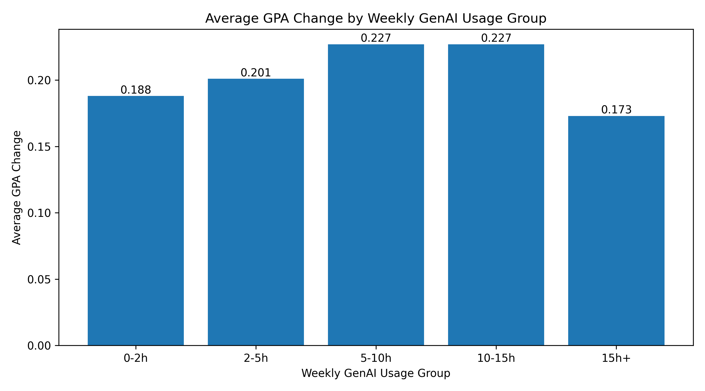
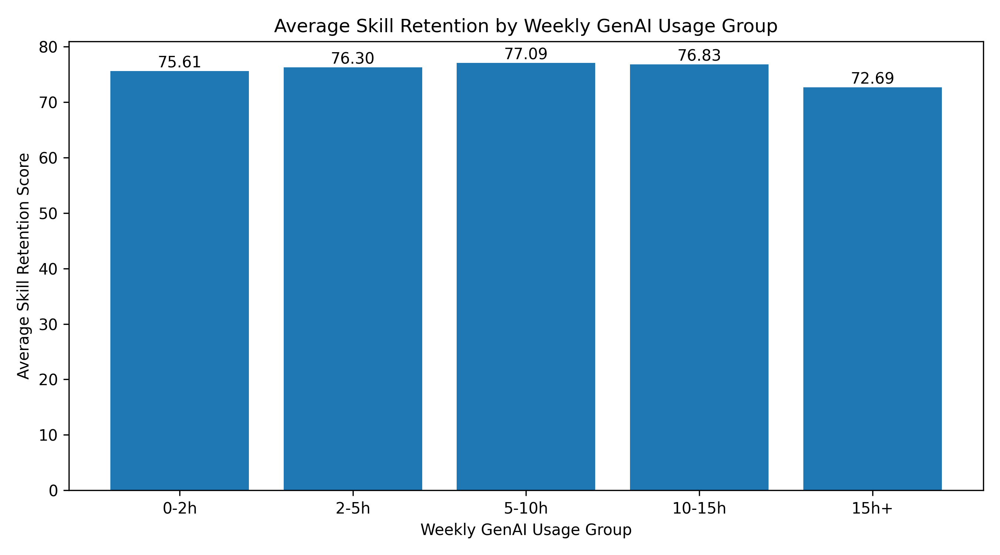
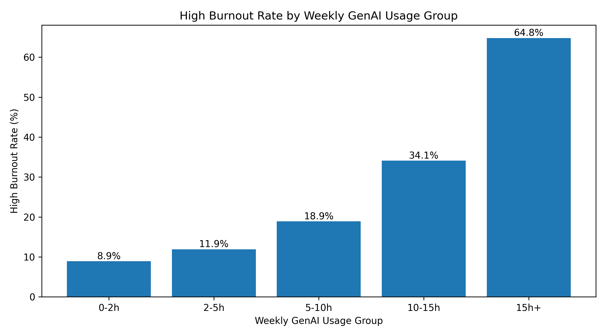
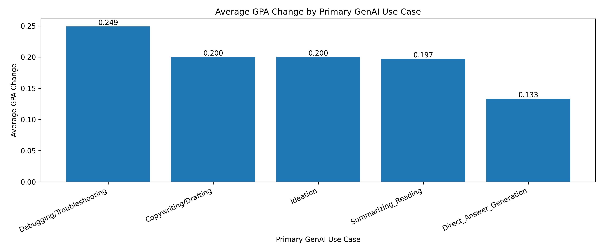
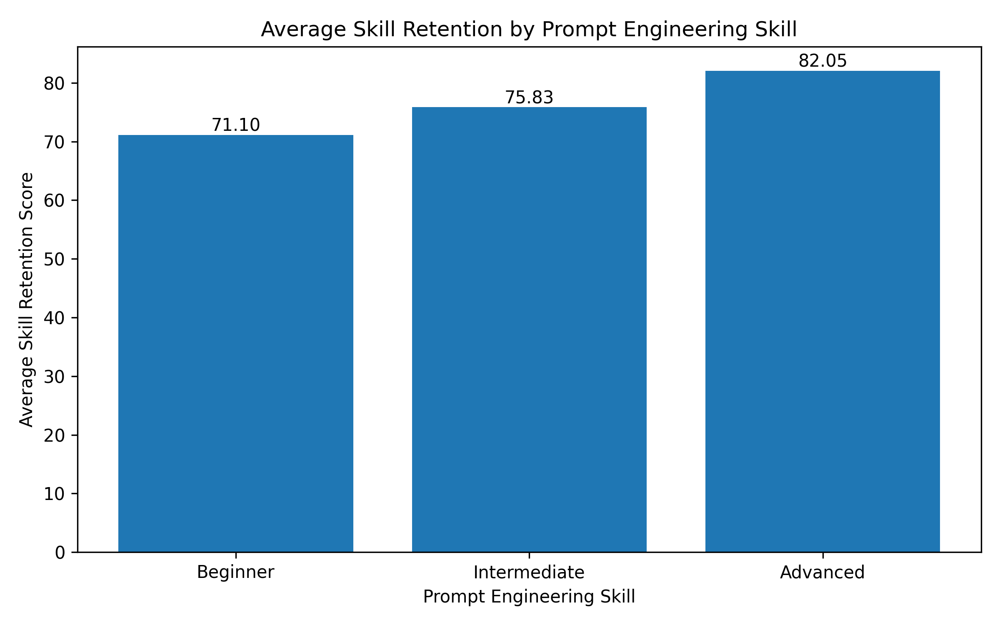
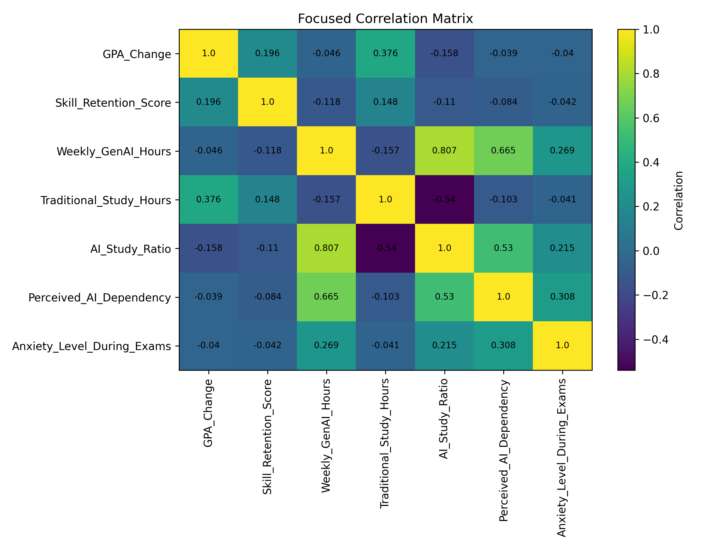

# Generative AI Use and Student Outcomes Analysis

## Project Overview

This project analyzes how Generative AI usage patterns relate to student academic performance, skill retention, perceived AI dependency, exam anxiety, and burnout risk.

Using a dataset of 50,000 student records, the project explores whether higher GenAI usage is always associated with better outcomes, or whether moderate and purposeful use is more favorable than very high or AI-heavy reliance.

The analysis includes data quality checks, feature engineering, exploratory data analysis, segmentation, correlation analysis, visualization, and final recommendations for responsible GenAI use in education.

## Main Research Question

How are Generative AI usage patterns associated with student academic performance, skill retention, AI dependency, exam anxiety, and burnout risk?

The project focuses on five main dimensions:

1. Weekly GenAI usage intensity
2. Primary GenAI use case
3. Prompt engineering skill level
4. Study balance between AI-supported and traditional study
5. Student context such as major, year of study, institutional policy, and paid subscription status

## Dataset

The dataset contains 50,000 student-level records and 16 original variables.

The original variables include:

- Student background information
- Pre-semester and post-semester GPA
- Weekly Generative AI usage hours
- Traditional study hours
- Primary GenAI use case
- Prompt engineering skill level
- Tool diversity
- Paid subscription status
- Perceived AI dependency
- Institutional AI policy
- Exam anxiety level
- Skill retention score
- Burnout risk level

## Tools and Technologies

- Python
- pandas
- NumPy
- matplotlib
- Jupyter Notebook
- CSV-based reporting
- GitHub project structure

## Project Structure

ai-student-impact-analysis/
│
├── data/
│   ├── raw/
│   │   └── ai_student_impact_dataset.csv
│   └── processed/
│       └── ai_student_impact_cleaned.csv
│
├── notebooks/
│   └── 01_eda_analysis.ipynb
│
├── reports/
│   ├── figures/
│   │   ├── avg_gpa_change_by_ai_hours_group.png
│   │   ├── avg_skill_retention_by_ai_hours_group.png
│   │   ├── high_burnout_rate_by_ai_hours_group.png
│   │   ├── avg_gpa_change_by_primary_use_case.png
│   │   ├── avg_skill_retention_by_prompt_skill.png
│   │   └── focused_correlation_matrix.png
│   │
│   └── tables/
│       ├── final_insights_summary.csv
│       ├── recommendations.csv
│       ├── summary_by_ai_hours_group.csv
│       ├── summary_by_primary_use_case.csv
│       ├── summary_by_prompt_engineering_skill.csv
│       └── correlation_matrix.csv
│
├── README.md
├── requirements.txt
└── .gitignore

## Key Findings

### 1. GenAI usage has a non-linear relationship with student outcomes

Moderate GenAI usage, especially around 5-15 hours per week, is associated with stronger average GPA improvement and skill retention.

However, the 15h+ group shows lower skill retention and a much higher high-burnout rate.

This suggests that more GenAI usage is not always associated with better outcomes.

### 2. Use case matters

Students who primarily use GenAI for Debugging/Troubleshooting show the strongest academic outcome pattern.

Students who primarily use GenAI for Direct Answer Generation show the weakest average GPA improvement and lower skill retention.

This suggests that GenAI may be more useful when it supports active problem solving rather than replacing the student's own reasoning.

### 3. Prompt engineering skill is strongly associated with learning retention

Advanced prompt users show substantially higher skill retention than beginner users.

They also show stronger GPA improvement.

This suggests that prompt engineering and AI literacy may be important for durable learning.

### 4. Study balance matters

Students should not be evaluated only by raw GenAI usage hours.

The share of total study time spent using AI is also important. AI-heavy study patterns may carry different academic and well-being risks than balanced study routines.

### 5. Context matters

Student outcomes differ by institutional policy, major category, year of study, and paid subscription status.

This suggests that responsible GenAI strategies should not be one-size-fits-all.

## Visual Highlights

### Average GPA Change by Weekly GenAI Usage Group

The 5-10h and 10-15h usage groups show the strongest average GPA improvement, while the 15h+ group shows lower improvement. This supports the finding that the relationship between GenAI usage and GPA improvement is not linear.

### Average Skill Retention by Weekly GenAI Usage Group

Skill retention is strongest around moderate GenAI usage and drops in the 15h+ group. This suggests that very high usage may be associated with weaker durable learning.

### High Burnout Rate by Weekly GenAI Usage Group

High burnout risk increases sharply among heavier GenAI usage groups, especially in the 15h+ group. This is one of the clearest risk patterns in the analysis.

### Average GPA Change by Primary GenAI Use Case

Debugging/Troubleshooting is associated with the highest average GPA improvement, while Direct Answer Generation is associated with the weakest improvement. This suggests that how students use GenAI matters.

### Average Skill Retention by Prompt Engineering Skill

Advanced prompt users show substantially higher skill retention than beginner users. This suggests that prompt engineering skill may be important for effective AI-supported learning.

### Focused Correlation Matrix

The correlation matrix provides a numerical overview of how GenAI usage, traditional study hours, AI study ratio, dependency, anxiety, GPA change, and skill retention relate to each other.

## Recommendations

Based on the analysis, the following recommendations can be made:

1. **Teach responsible GenAI use instead of only allowing or banning it**  
   Institutions should provide practical AI literacy training instead of treating GenAI as a simple yes/no issue.

2. **Encourage active learning use cases**  
   Students should be encouraged to use GenAI for debugging, troubleshooting, feedback, explanation, ideation, and guided learning.

3. **Discourage direct answer generation as the main use case**  
   Direct answer generation is associated with weaker GPA improvement and lower skill retention.

4. **Teach prompt engineering as an academic skill**  
   Advanced prompt users show much higher skill retention. Prompt engineering should be treated as part of academic skill development.

5. **Monitor very high GenAI usage**  
   The 15h+ group shows much higher burnout risk and lower skill retention. Heavy users may need support around workload, dependency, and study balance.

6. **Promote balanced study routines**  
   GenAI should complement traditional study, not fully replace it.

7. **Use segment-specific support**  
   STEM students, graduate students, paid subscription users, and students in strict-ban environments may need different forms of guidance and support.

   ## Limitations

This project has several important limitations:

1. **Observational data**  
   The analysis identifies associations, not causal effects.

2. **Self-reported variables**  
   Variables such as perceived AI dependency, prompt engineering skill, and anxiety may contain subjective bias.

3. **No full longitudinal behavior tracking**  
   The dataset includes pre-semester and post-semester GPA, but does not fully capture weekly behavior changes.

4. **Potential confounding factors**  
   Course difficulty, instructor policy, student background, workload, and prior academic ability may also influence outcomes.

5. **Correlation does not equal causation**  
   Grouped comparisons and correlations should be interpreted as descriptive evidence, not proof of direct causal relationships.

   ## Conclusion

This project shows that Generative AI usage in education is not simply good or bad. The relationship between GenAI and student outcomes depends on usage intensity, use case, prompt skill, study balance, and student context.

Moderate and purposeful GenAI use is associated with stronger academic outcomes, especially GPA improvement and skill retention. In contrast, very high GenAI usage and AI-heavy study patterns are associated with higher perceived dependency, higher exam anxiety, and higher burnout risk.

The strongest academic patterns appear among students who use GenAI for active problem solving, especially Debugging/Troubleshooting, and among students with advanced prompt engineering skills.

Overall, the analysis supports a responsible AI education strategy focused on guidance, balance, prompt literacy, active learning, and targeted support for higher-risk student groups.
